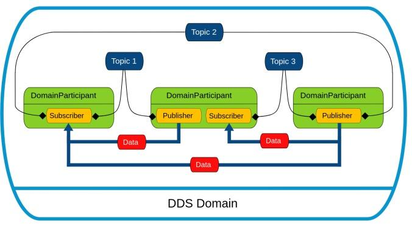

# 应用开发

## **SDK 概述**

Zvalley Robot SDK是基于DDS（数据分发服务）的高性能机器人控制软件开发工具包，专为机器人系统提供标准化的通信和控制接口。SDK采用现代化的C++架构设计，支持ROS2兼容的数据格式。

## **获取SDK**

### SDK介绍

Zvalley Robot SDK是中科云谷为新一代机器人推出的开发套件，对底层电机控制和高层运动控制进行了统一封装。SDK 提供标准化接口与示例工程，方便开发者快速完成机器人功能扩展与二次开发。 开发者可基于Zvalley Robot SDK高效构建移动平台、控制算法及应用系统。

### SDK 下载地址

https://github.com/Zvalley-Robotics/zv_robot_sdk.git

参考仓库中的 README 文档，在开发者计算机上完成 SDK 的安装

## 快速开发

### 环境依赖

| 计算机硬件 | 推荐配置        |
| :--------- | :-------------- |
| OS         | Ubuntu 22.04LTS |
| CPU        | x86_64          |
| CPU 核心数 | 4 核            |
| RAM        | 16 GB           |

### SDK使用

要使用该 SDK 构建自己的应用程序，您可以进入example目录，编写example程序并编译，运行编译后的可执行文件来验证功能。

```
cd examples
mkdir build && cd build
cmake ..
sudo make install
```

# 服务介绍

Zvalley Robot SDK的软件接口同时提供 **高层服务** 与 **底层服务** 两种能力，并分别采用不同的通信模式以满足不同的实时性需求。高层服务用于控制机器人的整体行为，如模式切换、全向移动、复合动作或头部控制等，这类指令以 RPC 的请求/响应方式调用，更适合一次性或低频的功能指令。底层服务则面向实时数据与底层控制，包括电机、IMU 等高频传感器数据的获取及电机的直接驱动控制，这部分接口基于 DDS 的订阅/发布模式，实现持续、高速的数据交互。

## 高层服务接口

### DDS 通信接口

####  **Cyclone DDS简介**

DDS 是一种分布式通信框架，由 OMG DDS 规范实现。通过发布/订阅方式让不同节点在没有中心服务器的情况下直接交换数据，并依靠 QoS 策略保证通信的可靠性与实时性。



#### 接口说明

`zv::robot` 提供 DDS 通信能力，用于在机器人系统内部或外部应用之间发送和接收消息。  主要类：`ChannelFactory`、`ChannelPublisher`、`ChannelSubscriber` 。  

---

**zv:: robot::ChannelFactory**

ChannelFactory 提供单例，用于创建基于 DDS Topic 的通道。使用前必须调用初始化接口，对底层 DDS 配置进行初始化。  

| 函数名     | Instance |
|-----------|------|
| 函数原型   | static zv:: robot::ChannelFactory*   zv:: robot::ChannelFactory::Instance() |
| 功能概述   | 获取单个实例静态指针 |
| 参数       | 无 |
| 返回值     | zv::/robot::ChannelFactory 单例静态指针 |
| 备注       | 无 |

| 函数名     | Release |
|-----------|------|
| 函数原型   | void Release() |
| 功能概述   | 释放 ChannelFactory 静态资源 |
| 参数       | 无 |
| 返回值     | 无 |
| 备注       | zv::/robot::ChannelFactory::Instance()->Release() |

| 函数名     | Init |
|-----------|------|
| 函数原型   | void Init(const nlohmann::json &config) |
| 功能概述   | 初始化工厂，并根据配置初始化内部 DDS 工厂 |
| 参数       | config：初始化所需的 JSON 配置信息 |
| 返回值     | 无 |
| 备注       | 无 |

| 函数名     | Init |
|-----------|------|
| 函数原型   | void Init(int32_t domainId, const std::string& networkInterface = "") |
| 功能概述   | 指定 Domain Id 和网络接口，对 ChannelFactory 初始化 |
| 参数       | domainId：默认构造 DdsParticipant 的域 id；networkInterface：指定带宽名，默认为空 |
| 返回值     | 无 |
| 备注       | 如果 networkInterface 为空，会生成自动选择的默认配置；外部开发应用程序时，enableSharedMemory 需设置为 false |

| 函数名     | CreateSendChannel |
|-----------|------|
| 函数原型   | 模板通道指针 CreateSendChannel(const std::string& name) |
| 功能概述   | 指定名称，创建一个指定消息类型为 MSG 的用于发送数据的通道 |
| 参数       | name：通道名称 |
| 返回值     | 模板通道指针 |
| 备注       | 无 |

| 函数名     | CreateRecvChannel |
|-----------|------|
| 函数原型   | 模板通道指针 CreateRecvChannel(const std::string& name, std::function<void(const void*)> callback, int32_t queuelen = 0) |
| 功能概述   | 指定名称，创建一个指定消息类型为 MSG 的用于接收数据的通道 |
| 参数       | name：通道名；callback：消息到达时的回调函数；queuelen：消息队列长度，如果为 0，则不启用队列 |
| 返回值     | 模板通道指针 |
| 备注       | 如果消息在回调函数中处理数千次，建议启用消息队列，避免 DDS 回调线程阻塞 |

---

**zv:: robot::ChannelPublisher**

实现指定类型的消息发布功能。  

| 类名       | 构造与析构 |
|-----------|------|
| template ChannelPublisher | explicit ChannelPublisher(const std::string& channelName); ~ChannelPublisher() |

| 函数名     | InitChannel |
|-----------|------|
| 函数原型   | void InitChannel() |
| 功能概述   | 初始化 Channel，准备用于发送消息 |
| 参数       | 无 |
| 返回值     | 无 |
| 备注       | 无 |

| 函数名     | CloseChannel |
|-----------|------|
| 函数原型   | void CloseChannel() |
| 功能概述   | 关闭 Channel |
| 参数       | 无 |
| 返回值     | 无 |
| 备注       | 无 |

| 函数名     | Write |
|-----------|------|
| 函数原型   | bool Write(const MSG& msg,int64_t wait_microsec =0) |
| 功能概述   | 发送指定类型的消息 |
| 参数       | msg：发送类型为 MSG 的消息 |
| 返回值     | true：发送成功；false：发送失败 |
| 备注       | 无 |

**DDS 发布示例 - Hello World**

示例路径：`examples/helloworld/publisher`

该示例演示了如何使用SDK 的ChannelPublisher API 发布一个简单的字符串消息

```cpp
#include <zv/robot/channel/channel_publisher.hpp>
#include "String_.hpp"

// 发布的话题名
static const std::string HELLO_WORLD_TOPIC = "rt/hello_world";

using namespace zv::robot;
using namespace zv::common;

int main() {
    // 初始化 Channel 工厂（进程级一次）
    ChannelFactory::Instance()->Init(0);

    // 创建并初始化 Publisher
    ChannelPublisher<std_msgs::msg::dds_::String_> publisher(HELLO_WORLD_TOPIC);
    publisher.InitChannel();
    int count = 0;
    while (true)
    {
        // 构造消息并写入 Channel
        std_msgs::msg::dds_::String_ msg("HelloWorld. " + std::to_string(count++));
        publisher.Write(msg);
        // 1Hz 发布
        sleep(1);
    }
    return 0;
}
```

---

**zv:: robot::ChannelSubscriber**

实现指定类型的消息订阅功能。  

| 类名       | 构造与析构 |
|-----------|------|
| template ChannelSubscriber | explicit ChannelSubscriber(const std::string& channelName); ~ChannelSubscriber() |

| 函数名     | InitChannel |
|-----------|------|
| 函数原型   | void InitChannel(const std::function<void(const void*)>& handler, int64_t queuelen = 0) |
| 功能概述   | 初始化 Channel，准备用于接收或处理消息 |
| 参数       | callback：消息到达时的回调函数；queuelen：消息缓存队列长度，如果为 0，不启用队列 |
| 返回值     | 无 |
| 备注       | 如果消息在回调函数中处理耗时较长，建议启用消息缓存队列，避免 DDS 回调线程阻塞 |

| 函数名     | CloseChannel |
|-----------|------|
| 函数原型   | void CloseChannel() |
| 功能概述   | 关闭 Channel |
| 参数       | 无 |
| 返回值     | 无 |
| 备注       | 无 |

| 函数名     | GetLastDataAvailableTime |
|-----------|------|
| 函数原型   | int64_t GetLastDataAvailableTime() |
| 功能概述   | 获取最后一次收到消息的时间 |
| 参数       | 无 |
| 返回值     | Channel 未初始化时返回-1；否则返回从系统启动开始单调递增的时间戳，精确到微秒 |
| 备注       | 无 |

**DDS 订阅示例 - Hello World**

示例路径：`examples/helloworld/subscriber`

该示例演示了如何使用SDK 的 ChannelSubscriber API 订阅一个字符串消息，并通过回调函数读取消息内容。

```cpp
#include <zv/robot/channel/channel_subscriber.hpp>
#include "String_.hpp"
#include <iostream>
#include <unistd.h>

// 订阅的话题名
static const std::string HELLO_WORLD_TOPIC = "rt/chatter";

using namespace zv::robot;
using namespace zv::common;

// 1.消息回调函数，当有消息到达指定话题时，会被 SDK 自动调用
void Handler(const void* msg)
{
    // 将通用指针转换为具体的 String_ 消息类型
    const std_msgs::msg::dds_::String_* hello_world_msg =
        (const std_msgs::msg::dds_::String_*)msg;

    // 打印接收到的消息内容
    std::cout << "message:" << hello_world_msg->data_() << std::endl;
}

int main()
{
    //2.初始化 Channel 工厂，负责管理 SDK 底层通信资源
    ChannelFactory::Instance()->Init(0);

    // 3. 创建 subscriber 对象，绑定话题和消息类型
    ChannelSubscriber<std_msgs::msg::dds_::String_> subscriber(HELLO_WORLD_TOPIC);

    // 4. 初始化通信通道并注册回调函数，注册 Handler 处理接收到的消息
    subscriber.InitChannel(Handler);

    // 5. 保持进程运行，subscriber 会在内部线程调用回调函数
    while (true)
    {
        sleep(10);
    }
    return 0;
}
```

---

<div style="page-break-after: always;"></div>

## 高层运控接口

#### 整体设计


#### 控制接⼝说明

**1. /motion_cmd 运动控制接⼝**

⽤于控制机器⼈基础运动（速度、步态等）。

**Topic**

```
/motion_cmd
```

**Message 类型**

```RemoteControlMotion.msg
float32 vx
float32 vy
float32 vyaw
float32 gait_step
bool is_continous
```

**参数说明**

| 参数         | 类型    | 说明                          |
| ------------ | ------- | ----------------------------- |
| vx           | float32 | 前后方向线速度(m/s)，正值前进 |
| vy           | float32 | 左右方向线速度(m/s)，正值左移 |
| vyaw         | float32 | 角速度(rad/s)，正值左转       |
| gait_step    | float32 | 步态步幅参数                  |
| is_continous | bool    | 是否连续运动                  |

**is_continous 说明**  (默认值：false)

| 值    | 含义               |
| ----- | ------------------ |
| true  | 持续执行该动作指令 |
| false | 最长执行时间：1s   |

**命令⾏使⽤示例**

```c++
# 向正前⽅以 1m/s 运动 1s 
ros2 topic pub /change_cmd robot_msgs/msg/RemoteControlMotion "{vx: 1, vy:  0, vyaw: 0, gait_step: 1, is_continous: false}" -1
```

**2. /change_cmd 切换接⼝**

⽤于切换机器⼈：

- 状态 
- 动作模型 
- 身份

**Topic**

```
/change_cmd
```

**Message 类型**

```c++
string key
string val
```

**参数说明**

| 参数 | 类型   | 说明     |
| ---- | ------ | -------- |
| key  | string | 指令类型 |
| val  | string | 指令值   |

**key 类型说明**

⽬前⽀持以下 key：

| key    | 说明           |
| ------ | -------------- |
| status | 切换机器人状态 |
| model  | 切换动作模型   |
| name   | 指定机器人身份 |

**status 参数说明**

| 值      | 说明       |
| ------- | ---------- |
| init    | 初始化状态 |
| ready   | 就绪状态   |
| rl_gait | 基于模型   |
| rl_rule | 基于规则   |
| stop    | 停⽌       |

**model 参数说明**

对应枚举：

```
ModelType
```

⽤于切换机器⼈动作模型。

可⽤模型：

| 模型      | 说明     |
| --------- | -------- |
| stil      | 静止     |
| stand     | 站立     |
| run       | 跑步     |
| hand2     | 招手     |
| mimic     | 模仿动作 |
| hiphop    | 嘻哈舞   |
| mojito    | Mojito舞 |
| warmup    | 热身动作 |
| newdance  | 新舞蹈   |
| kick      | 踢腿     |
| beyond    | beyond舞 |
| year      | 拜年     |
| shrug     | 耸肩     |
| bow       | 鞠躬     |
| salute    | 敬礼     |
| gentleman | 绅士动作 |
| introduce | 自我介绍 |
| dualhello | 双人问候 |
| show      | 展示动作 |
| flat      | 平衡动作 |

## 底层服务接口

底层通信负责实现用户侧 PC与机器人本体之间的数据交互，通讯机制基于 DDS 协议。

#### 接口说明

采用DDS通信接口里介绍的方法订阅或发布话题。话题信息存储在由 IDL 定义的结构体中，常用结构体有：

| 结构体名称     | 说明                                                         |
| -------------- | ------------------------------------------------------------ |
| JointCmd_      | 下发肢体动作指令，传递关节目标位置、速度、力矩及控制参数     |
| JointState_    | 反馈各关节的位置、速度、力矩及状态标志，为高层控制和监控提供实际状态数据 |
| AllJointCmd_   | 机器人关节控制指令的标准化数据容器，整合了指令的元信息（时间戳、序号）和核心控制数据（各关节指令）； |
| AllJointState_ | 机器人关节状态反馈的数据通信载体，整合了指令的元信息（时间戳、序号）和每个关节的实际状态列表（如位置、速度、力矩等）； |
| String_        | 包含单个 string 字段，用于传递简单文本消息，例如调试输出、状态文本等 |
| Time_          | 表示时间戳的基础类型，包含秒（sec）和纳秒（nanosec），用于标记消息生成时间，实现同步与时序控制 |

**底层 DDS 控制指令与状态反馈示例**

底层 DDS控制指令示例路径：examples/lowcmd/publisher.cpp

​    该示例演示了如何使用 SDK 发布肢体关节控制指令（AllJointCmd）DDS数据到 rt/all_joint_cmd话题，每条消息包含关节目标位置、速度、力矩及控制参数。

```cpp
#include <thread>
#include <zv/robot/channel/channel_publisher.hpp>
#include "AllJointCmd_.hpp"

static const std::string LOW_CMD_TOPIC = "rt/all_joint_cmd";

using namespace zv::robot;
using namespace zv::common;

int main()
{
    // 1. 初始化 Channel 工厂（全局通信资源）
    ChannelFactory::Instance()->Init(0);
    
    // 2. 创建 Publisher，绑定 Topic 和消息类型
    ChannelPublisher<robot_msgs::msg::dds::AllJointCmd_> publisher(LOW_CMD_TOPIC);
    
	// 3. 初始化通信通道
    publisher.InitChannel();

    while (true)
    {
        // 4. 构造 AllJointCmd_ 消息
        robot_msgs::msg::dds::AllJointCmd_ msg;
        std::vector<std::robot_msgs::msg::dds::JointCmd_> v_msg_joint;
        
        // 5. 构造每个关节的控制命令
        for (int i = 0; i < 23; i++)
        {
            robot_msgs::msg::dds::JointCmd_ msg_joint;
            msg_joint.joint_pos(0.11111 * i / 2);
            msg_joint.joint_vel(0.22222 * i / 3);
            msg_joint.joint_torque(0.33333 * i / 4);
            msg_joint.kp(0.444 * i / 4);
            msg_joint.kd(0.55555 * i / 7 * 1.1);
            v_msg_joint.push_back(msg_joint);
        }
        
		// 6. 发布消息到 Topic
        publisher.Write(msg);

        std::cout << "test [tx] " << std::endl;
        std::this_thread::sleep_for(std::chrono::seconds(1));
    }

    return 0;
}
```

底层 DDS状态反馈示例路径：examples/lowcmd/subscriber.cpp

​    该示例演示了如何使用SDK订阅机器人关节状态（AllJointState）DDS 数据，话题为 rt/all_joint_state，并通过回调函数中读取关节名称和位置。

```cpp
#include <chrono>
#include <thread>

#include <zv/robot/channel/channel_subscriber.hpp>
#include "AllJointState_.hpp"

// 订阅的话题名（机器人底盘 / 全关节状态）
static const std::string LOW_STATE_TOPIC = "rt/all_joint_state";

using namespace zv::robot;
using namespace zv::common;

// 1. 消息回调函数，当有 AllJointState_ 消息到达指定话题时，SDK 自动调用该函数
void Handler(const void* msg)
{
    // 将通用指针转换为具体的 AllJointState_ 消息类型
    const robot_msgs::msg::dds::AllJointState_* joint_state_msg = (const robot_msgs::msg::dds::AllJointState_*)msg;
    
    // 获取消息的时间戳和序号
    int64_t timestamp = joint_state_msg->timestamp();
    int64_t index = joint_state_msg->index();
    
    // 获取关节的状态信息
    std::vector<robot_msgs::msg::dds::JointState_> joint_states = joint_state_msg->joint_states();
    
	// 打印每条消息对应的序号和时间戳
    std::cout << "[Subscriber] Message received msg: " << index << ", timestamp: " << timestamp << std::endl;
    
    // 打印所有关节位置
    for (int i = 0; i < joint_states.size(); i++)
    {
        std::cout << "  joint " << i << " positions : " << joint_states[i].joint_pos() << std::endl;
    }
}

int main()
{
    // 2. 初始化 Channel 工厂，管理底层通信资源
    ChannelFactory::Instance()->Init(0);
    
    // 3. 创建 Subscriber 对象，绑定话题和消息类型
    ChannelSubscriber<robot_msgs::msg::dds::AllJointState_> subscriber(LOW_STATE_TOPIC);
    
    // 4. 初始化通信通道并注册回调函数
    subscriber.InitChannel(Handler);
    
    // 5. 保持进程运行，Subscriber 在内部线程接收消息并调用 Handler
    while (true)
    {
 std::this_thread::sleep_for(std::chrono::seconds(10));
    }
    return 0;
}
```

#### 消息类型介绍

**单个关节控制命令（JointCmd_）**

| 字段名            | 类型   | 描述             |
| ----------------- | ------ | ---------------- |
| **joint_pos_**    | double | 关节目标位置     |
| **joint_vel_**    | double | 关节目标速度     |
| **joint_torque_** | double | 关节目标力矩     |
| **kp_**           | double | 位置控制比例系数 |
| **kd_**           | double | 速度控制比例系数 |

**单个关节状态（JointState_）**

| 字段名            | 类型    | 描述         |
| ----------------- | ------- | ------------ |
| **joint_pos_**    | double  | 关节目标位置 |
| **joint_vel_**    | double  | 关节目标速度 |
| **joint_torque_** | double  | 关节目标力矩 |
| **temp_motor_**   | int32_t | 电机温度     |
| **temp_mos_**     | int32_t | MOS温度      |
| **error_**        | int32_t | 错误码       |

**所有关节集中控制命令（AllJointCmd_）**

| 字段名          | 类型                   | 描述                                     |
| --------------- | ---------------------- | ---------------------------------------- |
| **timestamp_**  | int64_t                | 时间戳，标记命令生成的时间               |
| **index_**      | int64_t                | 索引，标识命令序列                       |
| **cmd_type_**   | uint8_t                | 指定控制模式                             |
| **joint_cmds_** | std::vector<JointCmd_> | 关节命令数组，包含每个关节的具体控制参数 |

**所有关节状态（AllJointState_）**

| 字段名            | 类型                       | 描述                                 |
| ----------------- | -------------------------- | ------------------------------------ |
| **timestamp_**    | int64_t                    | 时间戳，标记状态数据生成的时间       |
| **index_**        | int64_t                    | 索引，标识状态序列                   |
| **joint_states_** | std::vector<joint_states_> | 关节状态数组，包含每个关节的详细信息 |

**所有关节状态（AllJointState_）**

| 字段名            | 类型                       | 描述                                 |
| ----------------- | -------------------------- | ------------------------------------ |
| **timestamp_**    | int64_t                    | 时间戳，标记状态数据生成的时间       |
| **index_**        | int64_t                    | 索引，标识状态序列                   |
| **joint_states_** | std::vector<joint_states_> | 关节状态数组，包含每个关节的详细信息 |

**远程控制参数配置（RemoteControlChange_）**

| 字段名   | 类型        | 描述   |
| -------- | ----------- | ------ |
| **key_** | std::string | 参数键 |
| **val_** | std::string | 参数值 |

**远程控制机器人运动（RemoteControlChange_）**

| 字段名            | 类型  | 描述             |
| ----------------- | ----- | ---------------- |
| **vx_**           | float | X轴方向线速度    |
| **vy_**           | float | Y轴方向线速度    |
| **vyaw_**         | float | 偏航角速度       |
| **gait_step_**    | float | 步态步长         |
| **is_continous_** | bool  | 是否连续运动标志 |
