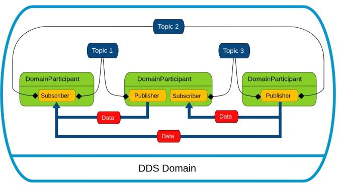
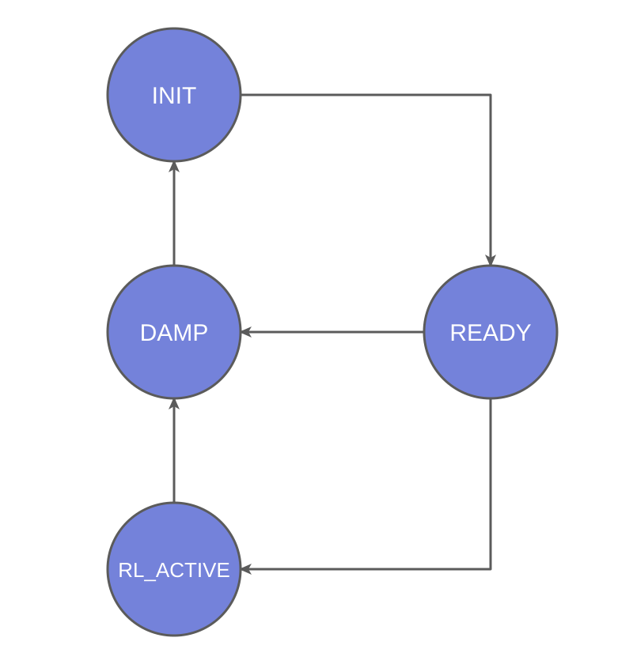

# 应用开发

## **SDK 概述**

Zvalley Robot SDK是基于DDS（数据分发服务）的高性能机器人控制软件开发工具包，专为机器人系统提供标准化的通信和控制接口。SDK采用现代化的C++架构设计，支持ROS2兼容的数据格式。

## **获取SDK**

### SDK介绍

Zvalley Robot SDK是中科云谷为新一代机器人推出的开发套件，对底层电机控制和高层运动控制进行了统一封装。SDK 提供标准化接口与示例工程，方便开发者快速完成机器人功能扩展与二次开发。 开发者可基于Zvalley Robot SDK高效构建移动平台、控制算法及应用系统。

### SDK 下载地址

https://github.com/Zvalley-Robotics/zv_robot_sdk.git

参考仓库中的 README 文档，在开发者计算机上完成 SDK 的安装。

## 快速开发

### 环境依赖

| 计算机硬件 | 推荐配置        |
| :--------- | :-------------- |
| OS         | Ubuntu 22.04LTS |
| CPU        | x86_64 / ARM64  |
| CPU 核心数 | 4 核            |
| RAM        | 16 GB           |

SDK 内置 MCAP 读取，若使用sdk进行数采需安装 LZ4、Zstd 运行库：

```bash
sudo apt-get install liblz4-1 libzstd1
```

### SDK使用

要使用该 SDK 构建自己的应用程序，您可以进入example目录，编写example程序并编译，运行编译后的可执行文件来验证功能。

```
cd examples
mkdir build && cd build
cmake ..
make
```

编译完成后，可执行文件会生成在 `build` 目录下，直接运行即可验证功能。

高层服务操作还需要机器人端相应服务在线。

# 服务介绍

Zvalley Robot SDK的软件接口同时提供 **高层服务** 与 **底层服务** 两种能力，并分别采用不同的通信模式以满足不同的实时性需求。高层服务用于控制机器人的整体行为，如模式切换、全向移动、复合动作或头部控制等，这类指令以 RPC 的请求/响应方式调用，更适合一次性或低频的功能指令。底层服务则面向实时数据与底层控制，包括电机、IMU 等高频传感器数据的获取及电机的直接驱动控制，这部分接口基于 DDS 的订阅/发布模式，实现持续、高速的数据交互。

## 高层服务接口

### DDS 通信接口

####  **Cyclone DDS简介**

DDS 是一种分布式通信框架，由 OMG DDS 规范实现。通过发布/订阅方式让不同节点在没有中心服务器的情况下直接交换数据，并依靠 QoS 策略保证通信的可靠性与实时性。



#### 接口说明

`zv::robot` 提供 DDS 通信能力，用于在机器人系统内部或外部应用之间发送和接收消息。  主要类：`ChannelFactory`、`ChannelPublisher`、`ChannelSubscriber` 。  

---

**zv:: robot::ChannelFactory**

ChannelFactory 提供单例，用于创建基于 DDS Topic 的通道。使用前必须调用初始化接口，对底层 DDS 配置进行初始化。  

| 函数名     | Instance |
|-----------|------|
| 函数原型   | static zv:: robot::ChannelFactory*   zv:: robot::ChannelFactory::Instance() |
| 功能概述   | 获取单个实例静态指针 |
| 参数       | 无 |
| 返回值     | zv::/robot::ChannelFactory 单例静态指针 |
| 备注       | 无 |

| 函数名     | Release |
|-----------|------|
| 函数原型   | void Release() |
| 功能概述   | 释放 ChannelFactory 静态资源 |
| 参数       | 无 |
| 返回值     | 无 |
| 备注       | zv::/robot::ChannelFactory::Instance()->Release() |

| 函数名     | Init |
|-----------|------|
| 函数原型   | void Init(const nlohmann::json &config) |
| 功能概述   | 初始化工厂，并根据配置初始化内部 DDS 工厂 |
| 参数       | config：初始化所需的 JSON 配置信息 |
| 返回值     | 无 |
| 备注       | 无 |

| 函数名     | Init |
|-----------|------|
| 函数原型   | void Init(int32_t domainId, const std::string& networkInterface = "") |
| 功能概述   | 指定 Domain Id 和网络接口，对 ChannelFactory 初始化 |
| 参数       | domainId：默认构造 DdsParticipant 的域 id；networkInterface：指定带宽名，默认为空 |
| 返回值     | 无 |
| 备注       | 如果 networkInterface 为空，会生成自动选择的默认配置；外部开发应用程序时，enableSharedMemory 需设置为 false |

| 函数名     | CreateSendChannel |
|-----------|------|
| 函数原型   | 模板通道指针 CreateSendChannel(const std::string& name) |
| 功能概述   | 指定名称，创建一个指定消息类型为 MSG 的用于发送数据的通道 |
| 参数       | name：通道名称 |
| 返回值     | 模板通道指针 |
| 备注       | 无 |

| 函数名     | CreateRecvChannel |
|-----------|------|
| 函数原型   | 模板通道指针 CreateRecvChannel(const std::string& name, std::function<void(const void*)> callback, int32_t queuelen = 0) |
| 功能概述   | 指定名称，创建一个指定消息类型为 MSG 的用于接收数据的通道 |
| 参数       | name：通道名；callback：消息到达时的回调函数；queuelen：消息队列长度，如果为 0，则不启用队列 |
| 返回值     | 模板通道指针 |
| 备注       | 如果消息在回调函数中处理数千次，建议启用消息队列，避免 DDS 回调线程阻塞 |

---

**zv:: robot::ChannelPublisher**

实现指定类型的消息发布功能。  

| 类名       | 构造与析构 |
|-----------|------|
| template ChannelPublisher | explicit ChannelPublisher(const std::string& channelName); ~ChannelPublisher() |

| 函数名     | InitChannel |
|-----------|------|
| 函数原型   | void InitChannel() |
| 功能概述   | 初始化 Channel，准备用于发送消息 |
| 参数       | 无 |
| 返回值     | 无 |
| 备注       | 无 |

| 函数名     | CloseChannel |
|-----------|------|
| 函数原型   | void CloseChannel() |
| 功能概述   | 关闭 Channel |
| 参数       | 无 |
| 返回值     | 无 |
| 备注       | 无 |

| 函数名     | Write |
|-----------|------|
| 函数原型   | bool Write(const MSG& msg,int64_t wait_microsec =0) |
| 功能概述   | 发送指定类型的消息 |
| 参数       | msg：发送类型为 MSG 的消息 |
| 返回值     | true：发送成功；false：发送失败 |
| 备注       | 无 |

**DDS 发布示例 - Hello World**

示例路径：`examples/helloworld/publisher.cpp`

该示例演示了如何使用SDK 的ChannelPublisher API 发布一个简单的字符串消息

```cpp
#include <unistd.h>

#include <zv/robot/channel/channel_publisher.hpp>

#include "String_.hpp"

// 发布的话题名
static const std::string HELLO_WORLD_TOPIC = "rt/hello_world";

using namespace zv::robot;
using namespace zv::common;

int main()
{
    // 初始化 Channel 工厂（进程级一次）
    ChannelFactory::Instance()->Init(0);

    // 创建并初始化 Publisher
    ChannelPublisher<std_msgs::msg::dds_::String_> publisher(HELLO_WORLD_TOPIC);
    publisher.InitChannel();
    int count = 0;
    while (true) {
        // 构造消息并写入 Channel
        std_msgs::msg::dds_::String_ msg("HelloWorld. " + std::to_string(count++));
        publisher.Write(msg);
        // 1Hz 发布
        sleep(1);
    }
    return 0;
}
```

---

**zv:: robot::ChannelSubscriber**

实现指定类型的消息订阅功能。  

| 类名       | 构造与析构 |
|-----------|------|
| template ChannelSubscriber | explicit ChannelSubscriber(const std::string& channelName); ~ChannelSubscriber() |

| 函数名     | InitChannel |
|-----------|------|
| 函数原型   | void InitChannel(const std::function<void(const void*)>& handler, int64_t queuelen = 0) |
| 功能概述   | 初始化 Channel，准备用于接收或处理消息 |
| 参数       | callback：消息到达时的回调函数；queuelen：消息缓存队列长度，如果为 0，不启用队列 |
| 返回值     | 无 |
| 备注       | 如果消息在回调函数中处理耗时较长，建议启用消息缓存队列，避免 DDS 回调线程阻塞 |

| 函数名     | CloseChannel |
|-----------|------|
| 函数原型   | void CloseChannel() |
| 功能概述   | 关闭 Channel |
| 参数       | 无 |
| 返回值     | 无 |
| 备注       | 无 |

| 函数名     | GetLastDataAvailableTime |
|-----------|------|
| 函数原型   | int64_t GetLastDataAvailableTime() |
| 功能概述   | 获取最后一次收到消息的时间 |
| 参数       | 无 |
| 返回值     | Channel 未初始化时返回-1；否则返回从系统启动开始单调递增的时间戳，精确到微秒 |
| 备注       | 无 |

**DDS 订阅示例 - Hello World**

示例路径：`examples/helloworld/subscriber.cpp`

该示例演示了如何使用SDK 的 ChannelSubscriber API 订阅一个字符串消息，并通过回调函数读取消息内容。

```cpp
#include <iostream>
#include <zv/robot/channel/channel_subscriber.hpp>

#include "String_.hpp"

// 订阅的话题名
static const std::string HELLO_WORLD_TOPIC = "rt/chatter";

using namespace zv::robot;
using namespace zv::common;

// 1.消息回调函数，当有消息到达指定话题时，会被 SDK 自动调用
void Handler(const void * msg)
{
    // 将通用指针转换为具体的 String_ 消息类型
    const std_msgs::msg::dds_::String_ * hello_world_msg = (const std_msgs::msg::dds_::String_ *)msg;

    // 打印接收到的消息内容
    std::cout << "message:" << hello_world_msg->data_() << std::endl;
}

int main()
{
    //2.初始化 Channel 工厂，负责管理 SDK 底层通信资源
    ChannelFactory::Instance()->Init(0);

    // 3. 创建 subscriber 对象，绑定话题和消息类型
    ChannelSubscriber<std_msgs::msg::dds_::String_> subscriber(HELLO_WORLD_TOPIC);

    // 4. 初始化通信通道并注册回调函数，注册 Handler 处理接收到的消息
    subscriber.InitChannel(Handler);

    // 5. 保持进程运行，subscriber 会在内部线程调用回调函数
    while (true) {
        std::this_thread::sleep_for(std::chrono::seconds(10));
    }
    return 0;
}
```

---

<div style="page-break-after: always;"></div>

## 高层运控接口

#### 整体设计



图中仅展示主要状态及切换方向，实际状态通过 `/robot/state` 确认。

#### 控制接⼝说明

**1. /robot/input/intent 运动控制接口**

用于向机器人下发统一控制意图，包含状态切换、动作模型切换、动作暂停/恢复与连续运动控制。

**Topic**

```
/robot/input/intent
```

**Message 类型**

```RobotIntent.msg
std_msgs/Header header
string source
string intent_type
string command
string action
float32 linear_x_mps
float32 linear_y_mps
float32 angular_z_radps
uint8 priority
```

**参数说明**

| 参数            | 类型           | 说明                                                                 |
| --------------- | -------------- | -------------------------------------------------------------------- |
| header          | std_msgs/Header| 标准消息头，stamp 用于判断意图是否过期                               |
| source          | string         | 意图来源，填 `sdk`      |
| intent_type     | string         | 意图类型：`status`、`motion`、`mode`、`model`、`config`、`reset`     |
| command         | string         | 具体命令，例如 `ready`、`walk`、`switch_model`、`speed`                      |
| action          | string         | 命令对象或参数；model 用模型名，mode 用 `rl`/`rule`，config 用配置值 |
| linear_x_mps    | float32        | 期望前进速度（m/s）                                                  |
| linear_y_mps    | float32        | 期望侧向速度（m/s）                                                  |
| angular_z_radps | float32        | 期望偏航角速度（rad/s）                                              |
| priority                                                                                                                                                           | uint8          | 意图优先级，填`50`                                                           |

**intent_type 与 command 组合**

| intent_type | command        | action   | 说明                                                       |
| ----------- | -------------- | -------- | ---------------------------------------------------------- |
| status      | `ready`/`walk`/`damp`/`reinit` | —        | 切换运动状态                                               |
| motion      | `walk`         | —        | 下发连续运动速度，速度写入 `linear_x_mps`/`linear_y_mps`/`angular_z_radps` |
| model       | `switch_model` | 模型名   | 切换动作模型                                               |
| model       | `motion_stop`  | `stop`   | 暂停当前动作（模型）的执行                                 |
| model       | `motion_stop`  | `resume` | 恢复当前动作（模型）的执行                                 |

**status 参数说明**

| 值      | 说明       |
| ------- | ---------- |
| ready   | 就绪状态   |
| walk    | 行走控制   |
| damp    | 阻尼状态   |
| reinit  | 重新初始化 |

**model 参数说明**

用于切换机器人动作模型，以及暂停和恢复当前动作（模型）的执行。

可用模型：

| 模型 | 说明 |
| ---- | ---- |
| z01_std_walk | 行走 |
| z01_pa_walk | 行走 |
| t4_walk | 行走 |
| t4_sprint | 快走 |
| t4_depth | 视觉行走 |
| t4_heart | 比心 |
| t4_salute | 敬礼 |
| t4_hello | 挥手 |
| t4_introduce | 自我介绍 |
| t4_introduce_left | 自我介绍（左） |
| t4_introduce_right | 自我介绍（右） |
| t4_high_five | 击掌 |
| t4_zl1 | 展览1 |
| t4_zl2 | 展览2 |
| t4_zl3 | 展览3 |
| t4_zl4 | 展览4 |
| t4_zl5 | 展览5 |
| t4_zl6 | 展览6 |
| t4_standby | 待机 |
| t4_clap | 鼓掌 |
| t4_handshake | 握手 |
| t4_rhello | 右手挥手 |
| t4_rintroduce_left | 自我介绍（左）（持续） |
| t4_rintroduce_right | 自我介绍（右）（持续） |
| t4_yb1 | 迎宾1 |
| t4_yb2 | 迎宾2 |
| t4_yb2_left | 左迎宾2 |
| t4_yb3 | 迎宾3 |
| t4_yb3_left | 左迎宾3 |
| t4_yb4 | 迎宾4 |
| t4_taichi | 动太极 |
| t4_taichi_w | 静太极 |
| t4_mj_dance | 滑步舞 |
| t4_xqxa123_dance | 相亲相爱舞 |
| t4_apt | APT舞 |
| t4_rhythm | 节奏舞 |

**motion 参数说明**

`motion` 为连续运动指令，推荐以 10Hz 持续下发；停止时下发三个速度均为 0 的意图。

| 参数            | 类型    | 说明                          |
| --------------- | ------- | ----------------------------- |
| linear_x_mps    | float32 | 前后方向线速度(m/s)，正值前进 |
| linear_y_mps    | float32 | 左右方向线速度(m/s)，正值左移 |
| angular_z_radps | float32 | 角速度(rad/s)，正值左转       |

**2. /robot/state 状态查询接口**

⽤于查询机器⼈当前系统状态、活动模式、活动模型及故障信息。

**Topic**

```
/robot/state
```

**Message 类型**

```RobotState.msg
std_msgs/Header header
uint8 state
string state_name
string active_mode
string active_control_source
string active_rl_model
bool fault_active
string fault_reason
```

**参数说明**

| 参数                  | 类型           | 说明                                                       |
| --------------------- | -------------- | ---------------------------------------------------------- |
| header                | std_msgs/Header| 标准消息头，stamp 为状态生成时间                           |
| state                 | uint8          | 当前系统状态，取 `STATE_*` 常量                            |
| state_name            | string         | 状态名称，例如 `READY`、`RL_ACTIVE`                        |
| active_mode           | string         | 当前活动模式，例如 `idle`、`rl`、`rule`、`debug`           |
| active_control_source | string         | 当前获得控制权的来源，例如 `teleop`、`api`、`rl_manager`   |
| active_rl_model       | string         | 当前活动 RL 模型名称；非 RL 模式可为空                     |
| fault_active          | bool           | 当前是否处于故障状态                                       |
| fault_reason          | string         | 当前主要故障原因；无故障时可为空                           |

**state 参数说明**

| 值                      | 说明           |
| ----------------------- | -------------- |
| STATE_BOOTING (0)       | 启动中         |
| STATE_INIT (1)          | 初始化         |
| STATE_IDLE (2)          | 空闲           |
| STATE_DO_READY (3)      | 准备就绪中     |
| STATE_READY (4)         | 就绪           |
| STATE_RL_STANDBY (5)    | RL 待命        |
| STATE_RL_ACTIVE (6)     | RL 运行        |
| STATE_RULE_STANDBY (7)  | 规则待命       |
| STATE_RULE_ACTIVE (8)   | 规则运行       |
| STATE_TRANSITIONING (9) | 切换中         |
| STATE_FAULT (10)        | 故障           |
| STATE_DAMP (11)         | 阻尼           |
| STATE_SHUTDOWN (12)     | 关闭           |

**3. 发布 RobotIntent 示例**

示例路径：`examples/highcmd/intent_publisher.cpp`

该示例演示如何使用 SDK 的 `ChannelPublisher` 发布 `RobotIntent_` 消息，依次完成状态切换、模型切换与连续运动控制。

```cpp
#include <unistd.h>

#include <zv/robot/channel/channel_publisher.hpp>

#include "RobotIntent_.hpp"

static const std::string INTENT_TOPIC = "rt/robot/input/intent";

using namespace zv::robot;
using namespace zv::common;

int main()
{
    // 1. 初始化 Channel 工厂（进程级一次）
    ChannelFactory::Instance()->Init(0);

    // 2. 创建并初始化 RobotIntent 发布者
    ChannelPublisher<robot_interfaces::msg::dds_::RobotIntent_> publisher(INTENT_TOPIC);
    publisher.InitChannel();

    // 3. 切换到 ready 状态：intent_type=status，command=ready
    robot_interfaces::msg::dds_::RobotIntent_ intent;
    intent.source_("sdk");
    intent.priority_(50);
    intent.intent_type_("status");
    intent.command_("ready");
    publisher.Write(intent);
    sleep(2);

    // 4. 切换动作模型：intent_type=model，command=switch_model，action=walk
    intent.intent_type_("model");
    intent.command_("switch_model");
    intent.action_("walk");
    publisher.Write(intent);
    sleep(2);

    // 5. 连续前进 0.3m/s：intent_type=motion，command=walk，约 20Hz 持续下发
    intent.intent_type_("motion");
    intent.command_("walk");
    intent.action_("");
    intent.linear_x_mps_(0.3F);
    intent.linear_y_mps_(0.0F);
    intent.angular_z_radps_(0.0F);
    for (int i = 0; i < 200; ++i) {
        publisher.Write(intent);
        usleep(50000);
    }

    // 6. 停止：下发零速度
    intent.linear_x_mps_(0.0F);
    intent.linear_y_mps_(0.0F);
    intent.angular_z_radps_(0.0F);
    publisher.Write(intent);
    return 0;
}
```

**4. 订阅 RobotState 示例**

示例路径：`examples/highcmd/state_subscriber.cpp`

该示例演示如何使用 SDK 的 `ChannelSubscriber` 订阅 `RobotState_` 消息，读取机器人当前状态、活动模式与模型。

```cpp
#include <unistd.h>

#include <iostream>
#include <zv/robot/channel/channel_subscriber.hpp>

#include "RobotState_.hpp"

static const std::string STATE_TOPIC = "rt/robot/state";
// 桥接配置：reliability=best_effort, history=keep_last, depth=5。
static constexpr int64_t STATE_QUEUE_LEN = 5;
static constexpr bool STATE_RELIABLE = false;

using namespace zv::robot;
using namespace zv::common;

// 1. 消息回调函数，当有 RobotState_ 消息到达指定话题时，SDK 自动调用该函数
void Handler(const void * msg)
{
    const auto * state = static_cast<const robot_interfaces::msg::dds_::RobotState_ *>(msg);

    // 2. 读取状态字段并打印
    std::cout << "state: " << static_cast<int>(state->state_()) << ", state_name: " << state->state_name_()
              << ", active_mode: " << state->active_mode_() << ", active_rl_model: " << state->active_rl_model_()
              << std::endl;
}

int main()
{
    // 3. 初始化 Channel 工厂
    ChannelFactory::Instance()->Init(0);

    // 4. 创建 Subscriber 对象，绑定话题和消息类型
    ChannelSubscriber<robot_interfaces::msg::dds_::RobotState_> subscriber(STATE_TOPIC);

    // 5. 初始化通信通道并注册回调函数（QoS 与 robot_external_bridge 保持一致）
    subscriber.InitChannel(Handler, STATE_QUEUE_LEN, STATE_RELIABLE);

    // 6. 保持进程运行，Subscriber 在内部线程接收消息并调用 Handler
    while (true) {
        sleep(10);
    }
    return 0;
}
```

## 数据采集接口

`zv::robot::DataCollectionClient` 用于控制机器人端开始和结束数据录制。
使用前需初始化 DDS 通信，并确保机器人端数据采集及相应 RPC 服务在线。

| 接口 | 说明 |
| ---- | ---- |
| `StartRecording()` | 开始录制 |
| `StopRecording(RecordingInfo& recording)` | 结束录制，并返回录制文件信息及消息数量 |

接口返回 `0` 表示成功，非 `0` 表示失败，错误详情可通过 `GetLastErrorMessage()` 获取。
`StopRecording()` 仅结束录制并返回文件信息，不自动下载文件。

**开始/结束录制示例**

```cpp
#include <iostream>
#include <zv/robot/channel/channel_factory.hpp>
#include <zv/robot/data_collection/data_collection_client.hpp>

int main()
{
    // 1. 初始化通信和数据采集客户端，Domain ID 和网卡按实际环境设置
    zv::robot::ChannelFactory::Instance()->Init(0);
    zv::robot::DataCollectionClient client;
    client.Init();
    client.SetTimeout(30.0f);

    // 2. 开始录制
    int32_t result = client.StartRecording();
    if (result != 0) {
        std::cerr << "开始录制失败，code=" << result << ": " << client.GetLastErrorMessage() << '\n';
        return 1;
    }
    std::cout << "录制已开始，按 Enter 结束录制。" << std::endl;
    std::cin.get();

    // 3. 结束录制，获取机器人端文件信息
    zv::robot::RecordingInfo recording;
    result = client.StopRecording(recording);
    if (result != 0) {
        std::cerr << "结束录制失败，code=" << result << ": " << client.GetLastErrorMessage() << '\n';
        return 1;
    }
    std::cout << "文件名：" << recording.file.name << "\n远端路径：" << recording.file.path
              << "\n文件大小（字节）：" << recording.file.size << "\n消息数量：" << recording.message_count << '\n';
    return 0;
}
```

录制文件下载及 MCAP 读取、解析请参考
[examples/data_collection/data_collection.cpp](examples/data_collection/data_collection.cpp)：
其中 `DownloadRecording()` 演示文件下载，`ReadMcapFile()` 演示逐条读取消息，
并通过 `McapMessage::DecodeJson()` 获取业务字段预览。

## 底层服务接口

底层通信负责实现用户侧 PC与机器人本体之间的数据交互，通讯机制基于 DDS 协议。

#### 接口说明

采用DDS通信接口里介绍的方法订阅或发布话题。话题信息存储在由 IDL 定义的结构体中，常用结构体有：

| 结构体名称          | 说明                                                                 |
| ------------------- | -------------------------------------------------------------------- |
| JointState_         | 单个逻辑关节反馈状态，包含位置/速度/力矩、电机温度、错误码及错误说明 |
| JointStates_        | 多关节反馈状态帧，包含序号、最近命令关联 ID 及关节状态列表           |
| HeadControl_        | 头部偏航/俯仰角控制指令，单位为度                                    |
| Twist_              | 底盘移动速度指令，包含线速度（m/s）、角速度（rad/s） |

**底层 DDS 控制指令与状态反馈示例**

底层 DDS控制指令示例路径：examples/lowcmd/publisher.cpp

​    该示例演示了如何使用 SDK 发布头部控制指令（HeadControl）和底盘速度指令（Twist）DDS数据，分别发布到 rt/robot/external/head_control 和 rt/cmd_vel 话题。头部消息包含目标偏航角、俯仰角及相对/绝对角度标志，底盘消息包含线速度和角速度。

​    示例以 1 Hz 发布，默认头部目标为绝对角度 0°，底盘为零速度。头部角度单位为度，底盘线速度单位为 m/s、角速度单位为 rad/s；按 Ctrl+C 或收到 SIGTERM 退出时，补发一帧零速度。

```cpp
#include <chrono>
#include <csignal>
#include <iostream>
#include <string>
#include <thread>
#include <zv/robot/channel/channel_publisher.hpp>

#include "HeadControl_.hpp"
#include "Twist_.hpp"

// DDS 话题名 = rt + ROS2 绝对路径。
static const std::string HEAD_CONTROL_TOPIC = "rt/robot/external/head_control";
static const std::string CMD_VEL_TOPIC = "rt/cmd_vel";
static constexpr auto PUBLISH_PERIOD = std::chrono::seconds(1);

static volatile std::sig_atomic_t keep_running = 1;

static void HandleSignal(int) { keep_running = 0; }

using namespace zv::robot;

int main()
{
    std::signal(SIGINT, HandleSignal);
    std::signal(SIGTERM, HandleSignal);

    // 1. 初始化 Channel 工厂（全局通信资源）
    ChannelFactory::Instance()->Init(0);

    // 2. 创建 Publisher，绑定 Topic 和消息类型
    ChannelPublisher<robot_interfaces::msg::dds_::HeadControl_> head_publisher(HEAD_CONTROL_TOPIC);
    ChannelPublisher<geometry_msgs::msg::dds_::Twist_> velocity_publisher(CMD_VEL_TOPIC);

    // 3. 初始化通信通道
    head_publisher.InitChannel();
    velocity_publisher.InitChannel();

    // 4. 构造 HeadControl_ 消息，设定头部控制参数
    // 按需修改目标角度（度）。持续发布使用绝对角度，避免相对角度累加。
    robot_interfaces::msg::dds_::HeadControl_ head;
    head.yaw_(0.0f);
    head.pitch_(0.0f);
    head.is_relative_(false);

    // 5. 构造 Twist_ 消息，设定底盘控制参数
    // 按需修改底盘速度：linear.x/y 为 m/s，angular.z 为 rad/s。
    // 其余分量保持零值。
    geometry_msgs::msg::dds_::Twist_ velocity;
    velocity.linear_().x_(0.0);
    velocity.linear_().y_(0.0);
    velocity.angular_().z_(0.0);

    std::cout << "Publishing " << HEAD_CONTROL_TOPIC << " and " << CMD_VEL_TOPIC << " at 1 Hz; press Ctrl+C to stop."
              << std::endl;

    auto next_publish_time = std::chrono::steady_clock::now();
    while (keep_running != 0) {
        // 6. 发布消息到 Topic
        head_publisher.Write(head);
        velocity_publisher.Write(velocity);
        next_publish_time += PUBLISH_PERIOD;
        std::this_thread::sleep_until(next_publish_time);
    }

    velocity_publisher.Write(geometry_msgs::msg::dds_::Twist_{});
    std::cout << "Stopped; sent zero velocity." << std::endl;
    return 0;
}
```

底层 DDS状态反馈示例路径：examples/lowcmd/subscriber.cpp

​    该示例演示了如何使用SDK订阅机器人关节状态（JointStates）DDS 数据，话题为 rt/robot/driver/joint_states（对应 robot_external_bridge 的 /robot/driver/joint_states），并通过回调函数中读取关节名称、位置/速度/力矩及错误信息。

```cpp
#include <chrono>
#include <iostream>
#include <thread>
#include <zv/robot/channel/channel_subscriber.hpp>

#include "JointStates_.hpp"

// 订阅的话题名（机器人全关节状态，对应 /robot/driver/joint_states）
static const std::string LOW_STATE_TOPIC = "rt/robot/driver/joint_states";
// 桥接配置：reliability=best_effort, history=keep_last, depth=5。
static constexpr int64_t LOW_STATE_QUEUE_LEN = 5;
static constexpr bool LOW_STATE_RELIABLE = false;

using namespace zv::robot;
using namespace zv::common;

// 1. 消息回调函数，当有 JointStates_ 消息到达指定话题时，SDK 自动调用该函数
void Handler(const void * msg)
{
    // 将通用指针转换为具体的 JointStates_ 消息类型
    const auto * joint_state_msg = static_cast<const robot_interfaces::msg::dds_::JointStates_ *>(msg);

    // 获取状态帧序号及最近命令关联信息
    const uint32_t sequence = joint_state_msg->sequence_();
    const uint64_t last_command_trace_id = joint_state_msg->last_command_trace_id_();
    const uint32_t last_command_sequence = joint_state_msg->last_command_sequence_();
    const auto & joint_states = joint_state_msg->states_();

    // 打印状态帧序号及最近命令关联
    std::cout << "[Subscriber] Message received sequence: " << sequence
              << ", last command trace id: " << last_command_trace_id
              << ", last command sequence: " << last_command_sequence << std::endl;

    // 打印所有关节状态（uint8_t 需转 int 打印，避免被当作字符）
    for (size_t i = 0; i < joint_states.size(); i++) {
        const auto & js = joint_states[i];
        std::cout << "    joint " << i << " name: " << js.joint_name_() << ", position: " << js.position_()
                  << ", velocity: " << js.velocity_() << ", effort: " << js.effort_()
                  << ", motor_error: " << static_cast<int>(js.motor_error_())
                  << ", joint_error: " << static_cast<int>(js.joint_error_())
                  << ", error_message: " << js.error_message_() << std::endl;
    }
}

int main()
{
    // 2. 初始化 Channel 工厂，管理底层通信资源
    ChannelFactory::Instance()->Init(0);

    // 3. 创建 Subscriber 对象，绑定话题和消息类型
    ChannelSubscriber<robot_interfaces::msg::dds_::JointStates_> subscriber(LOW_STATE_TOPIC);

    // 4. 初始化通信通道并注册回调函数（QoS 与 robot_external_bridge 保持一致）
    subscriber.InitChannel(Handler, LOW_STATE_QUEUE_LEN, LOW_STATE_RELIABLE);

    // 5. 保持进程运行，Subscriber 在内部线程接收消息并调用 Handler
    while (true) {
        std::this_thread::sleep_for(std::chrono::seconds(10));
    }
    return 0;
}
```

**IMU / 导航数据订阅示例**

示例路径：examples/imu_nav/subscriber.cpp

​    该示例演示了如何使用 SDK 订阅 IMU 与组合导航融合数据（NavAll_），话题为 rt/robot/imu/nav_all（对应 robot_external_bridge 的 /robot/imu/nav_all），并在回调函数中读取加速度、角速度、欧拉角、四元数、GNSS 经纬高、东北天速度、UTC 时间、融合/GNSS 状态、温度与气压等信息。

```cpp
#include <chrono>
#include <iostream>
#include <thread>
#include <zv/robot/channel/channel_subscriber.hpp>

#include "NavAll_.hpp"

// 订阅的话题名（IMU / 组合导航融合数据）
static const std::string NAV_ALL_TOPIC = "rt/robot/imu/nav_all";

using namespace zv::robot;
using namespace zv::common;

// 1. 消息回调函数，当有 NavAll_ 消息到达指定话题时，SDK 自动调用该函数
void Handler(const void * msg)
{
    // 将通用指针转换为具体的 NavAll_ 消息类型
    const yesense_interface::msg::dds_::NavAll_ * nav_msg = (const yesense_interface::msg::dds_::NavAll_ *)msg;

    // 取出各子结构体引用
    const auto & acc = nav_msg->acc_();
    const auto & gyro = nav_msg->gyro_();
    const auto & euler = nav_msg->euler_();
    const auto & quat = nav_msg->quat_();
    const auto & pos = nav_msg->pos_();
    const auto & vel = nav_msg->vel_();
    const auto & status = nav_msg->status_();
    const auto & temp = nav_msg->temp_();
    const auto & pressure = nav_msg->pressure_();
    const auto & utc = nav_msg->utc_();
    uint16_t tid = nav_msg->tid_().tid_();

    // uint8_t 直接输出会被当作字符，转 int 打印
    std::cout << "===== IMU NavAll =====" << std::endl;
    std::cout << "  tid: " << tid << std::endl;
    std::cout << "  acc  [x, y, z]: " << acc.x_() << ", " << acc.y_() << ", " << acc.z_() << std::endl;
    std::cout << "  gyro [x, y, z]: " << gyro.x_() << ", " << gyro.y_() << ", " << gyro.z_() << std::endl;
    std::cout << "  euler [pitch, roll, yaw]: " << euler.pitch_() << ", " << euler.roll_() << ", " << euler.yaw_()
              << std::endl;
    std::cout << "  quat [q0, q1, q2, q3]: " << quat.q0_() << ", " << quat.q1_() << ", " << quat.q2_() << ", "
              << quat.q3_() << std::endl;
    std::cout << "  gnss [lon, lat, alt]: " << pos.longitude_() << ", " << pos.latitude_() << ", " << pos.altitude_()
              << std::endl;
    std::cout << "  vel  [e, n, u]: " << vel.vel_e_() << ", " << vel.vel_n_() << ", " << vel.vel_u_() << std::endl;
    std::cout << "  utc  [" << static_cast<int>(utc.year_()) << "-" << static_cast<int>(utc.month_()) << "-"
              << static_cast<int>(utc.day_()) << " " << static_cast<int>(utc.hour_()) << ":"
              << static_cast<int>(utc.min_()) << ":" << static_cast<int>(utc.sec_()) << "." << utc.ms_() << "]"
              << std::endl;
    std::cout << "  status [fusion, gnss]: " << static_cast<int>(status.fusion_status_()) << ", "
              << static_cast<int>(status.gnss_status_()) << std::endl;
    std::cout << "  temp: " << temp.temp_() << std::endl;
    std::cout << "  pressure: " << pressure.val_() << std::endl;
}

int main()
{
    // 2. 初始化 Channel 工厂，管理底层通信资源
    ChannelFactory::Instance()->Init(0);

    // 3. 创建 Subscriber 对象，绑定话题和消息类型
    ChannelSubscriber<yesense_interface::msg::dds_::NavAll_> subscriber(NAV_ALL_TOPIC);

    // 4. 初始化通信通道并注册回调函数
    subscriber.InitChannel(Handler);

    // 5. 保持进程运行，Subscriber 在内部线程接收消息并调用 Handler
    while (true) {
        std::this_thread::sleep_for(std::chrono::seconds(10));
    }

    return 0;
}
```

> 该示例对应 `examples/CMakeLists.txt` 中的 `imuNavSubscriber` 构建目标，编译后生成 `imuNavSubscriber` 可执行文件。

**DDS 相机预览示例**

示例路径：examples/camera/subscriber.cpp

`CameraSubscriber` 订阅 head 相机的压缩图像，通过 `TakeFrame()` 非阻塞获取最新帧。
运行前确保相机驱动已发布图像，并按实际环境设置话题、网卡和域 ID；

```cpp
#include <unistd.h>

#include <iostream>
#include <map>
#include <zv/robot/media/camera_subscriber.hpp>

int main()
{
    // 1. 配置相机名称与完整 DDS 话题的映射
    const std::map<std::string, std::string> topics{
        {"head", "rt/media/camera/head/color/image_raw/compressed"}
    };

    // 2. 创建并初始化 CameraSubscriber，绑定相机名称与话题
    zv::robot::CameraSubscriber subscriber;
    subscriber.Init(0, "", topics);

    // 3. 持续轮询各相机的最新压缩图像
    zv::robot::CameraFrame frame;
    while (true) {
        for (const auto & [name, topic] : topics) {
            // TakeFrame 非阻塞返回该相机是否有新的可用帧。
            if (subscriber.TakeFrame(name, frame)) {
                // 4. 输出相机名称、图像帧标识、压缩格式和数据长度
                std::cout << name << ": " << frame.frame_id << ", " << frame.format << ", " << frame.data.size()
                          << " bytes" << std::endl;
            }
        }
        // 5. 每 100ms 轮询一次，避免空轮询占用 CPU
        usleep(100000);
    }

    return 0;
}
```

#### 消息类型介绍

以下消息类型均位于命名空间 `robot_interfaces::msg::dds_`，字段名末尾保留 DDS 生成的 `_` 后缀。

**单个关节状态（JointState_）**

| 字段名              | 类型        | 描述                                                         |
| ------------------- | ----------- | ------------------------------------------------------------ |
| **joint_name_**     | std::string | 关节名称                                                     |
| **position_**       | float       | 当前位置（rad 或 m）                                         |
| **velocity_**       | float       | 当前速度（rad/s 或 m/s）                                     |
| **effort_**         | float       | 当前力矩/推力（Nm 或 N）                                     |
| **motor_temp_**     | float       | 电机温度（摄氏度），不可用时为 0                             |
| **mos_temp_**       | float       | MOS 温度（摄氏度） |
| **motor_error_**    | uint8_t     | 电机驱动底层故障码，由 Encos/EtherCAT 直接读取               |
| **enabled_**        | bool        | 当前关节是否处于使能状态                                     |
| **joint_error_**    | uint8_t     | 关节错误码，取值为 `JOINT_ERR_*` 常量                        |
| **error_message_**  | std::string | 人类可读错误说明；无错误时可为空字符串                       |

`joint_error_` 取值（`JointState_Constants`）：

| 常量                              | 值 | 含义                       |
| --------------------------------- | -- | -------------------------- |
| **JOINT_ERR_NONE_**               | 0  | 关节正常                   |
| **JOINT_ERR_MOTOR_WARN_**         | 1  | 电机或驱动器底层告警       |
| **JOINT_ERR_INVALID_ANGLE_STATE_**| 2  | 反馈角度/位置非法          |
| **JOINT_ERR_INVALID_ANGLE_CMD_**  | 3  | 目标角度/位置命令非法      |
| **JOINT_ERR_ZERO_ABSENCE_**       | 4  | 零位缺失或零点状态异常     |

**多关节状态帧（JointStates_）**

| 字段名                       | 类型                       | 描述                                                        |
| ---------------------------- | -------------------------- | ----------------------------------------------------------- |
| **header_**                  | std_msgs::msg::dds_::Header_ | 标准消息头，stamp 为反馈生成时间                          |
| **sequence_**                | uint32_t                   | 状态帧序号，用于检测丢帧、乱序或重复                        |
| **last_command_trace_id_**   | uint64_t                   | 最近一次被接收/应用的命令 trace_id                          |
| **last_command_sequence_**   | uint32_t                   | 最近一次被接收/应用的命令帧序号              |
| **states_**                  | std::vector<JointState_>   | 关节状态列表，建议按机器人配置中的关节顺序排列              |

**统一高层控制意图（RobotIntent_）**

| 字段名                 | 类型                          | 描述                                                                 |
| ---------------------- | ----------------------------- | -------------------------------------------------------------------- |
| **header_**            | std_msgs::msg::dds_::Header_  | 标准消息头，stamp 用于判断意图是否过期                               |
| **source_**            | std::string                   | 意图来源，例如 `teleop`、`http`、`mqtt`、`sdk`、`cloud`、`test`      |
| **intent_type_**       | std::string                   | 意图类型：`status`、`motion`、`mode`、`model`、`config`、`reset`     |
| **command_**           | std::string                   | 具体命令，例如 `ready`、`walk`、`switch_mode`、`switch_model`、`speed` |
| **action_**            | std::string                   | 命令对象或参数；mode 用 `rl`/`rule`，model 用模型名，config 用配置值 |
| **linear_x_mps_**      | float                         | 期望前进速度（m/s）                                                  |
| **linear_y_mps_**      | float                         | 期望侧向速度（m/s）                                                  |
| **angular_z_radps_**   | float                         | 期望偏航角速度（rad/s）                                              |
| **priority_**          | uint8_t                       | 意图优先级                                                           |

**机器人系统状态（RobotState_）**

| 字段名                       | 类型                          | 描述                                                       |
| ---------------------------- | ----------------------------- | ---------------------------------------------------------- |
| **header_**                  | std_msgs::msg::dds_::Header_  | 标准消息头，stamp 为状态生成时间                           |
| **state_**                   | uint8_t                       | 当前系统状态，取 `STATE_*` 常量                            |
| **state_name_**              | std::string                   | 状态名称，便于日志和外部 API 展示                          |
| **active_mode_**             | std::string                   | 当前活动模式，例如 `idle`、`rl`、`rule`、`debug`           |
| **active_control_source_**   | std::string                   | 当前获得控制权的来源，例如 `teleop`、`api`、`rl_manager`   |
| **active_rl_model_**         | std::string                   | 当前活动 RL 模型名称；非 RL 模式可为空                     |
| **fault_active_**            | bool                          | 当前是否处于故障状态                                       |
| **fault_reason_**            | std::string                   | 当前主要故障原因；无故障时可为空                           |

`state_` 取值（`RobotState_Constants`）：`STATE_BOOTING_=0`、`STATE_INIT_=1`、`STATE_IDLE_=2`、`STATE_DO_READY_=3`、`STATE_READY_=4`、`STATE_RL_STANDBY_=5`、`STATE_RL_ACTIVE_=6`、`STATE_RULE_STANDBY_=7`、`STATE_RULE_ACTIVE_=8`、`STATE_TRANSITIONING_=9`、`STATE_FAULT_=10`、`STATE_DAMP_=11`、`STATE_SHUTDOWN_=12`。

**头部控制指令（HeadControl_）**

| 字段名            | 类型   | 描述                                    |
| ----------------- | ------ | --------------------------------------- |
| **yaw_**          | float  | 目标偏航角（度，-180 ~ 180）            |
| **pitch_**        | float  | 目标俯仰角（度，-180 ~ 180）            |
| **is_relative_**  | bool   | true=相对角度，false=绝对角度           |

**版本信息（VersionInfo_）**

| 字段名            | 类型        | 描述                              |
| ----------------- | ----------- | --------------------------------- |
| **version_**      | std::string | 版本号，例如 `zl_robot-v1.1.11`   |
| **release_date_** | std::string | 发布日期，例如 `2025-07-17`       |

**其他状态消息**

| 结构体            | 关键字段                                                                                                |
| ----------------- | ------------------------------------------------------------------------------------------------------- |
| **BatteryInfo_**  | 总压、电流、SOC、寿命、温度、电压/温度统计、MOS 状态、电池状态、限流/保护信息                            |
| **DriverStatus_** | 驱动状态（`STATUS_*`）、在线状态、硬件使能、故障状态、关节总数/活动/故障计数、故障关节名称列表          |
| **SystemStatus_** | CPU/内存/磁盘占用率与温度、电池电压/电流/SOC、音量、是否静音及各项阈值告警标志                            |
| **RlManagerStatus_** | 节点在线、模型加载/就绪、推理活动/错误、活动模型、模型类型、推理频率及最近推理耗时                     |
| **SpeakStatus_**  | 播放状态（`STATE_IDLE/PLAYING/PAUSED`）、当前文本、队列长度                                              |
| **AudioRequest_** | 请求类型 `kind_`（提示文本/文件/临时 TTS）、内容 `name_`、优先级 `priority_`、中断标志 `interrupt_` |
| **FollowControl_** | 跟随控制命令 `command_`（进入/退出跟踪模式） |
| **RlModelInfo_** | 模型名称 `name_`、别名 `alias_`、分类 `category_`、后端 `backend_`、时长 `duration_sec_`、时长有效标志 `has_duration_` |

Python 对应提供 `AudioRequest_`、`FollowControl_`、`RlModelInfo_` 类型，
以及 `ChannelPublisher_AudioRequest_`、`ChannelPublisher_FollowControl_` 发布器。
常量位于 `AudioRequest_Constants`（`KIND_TIP_`、`KIND_FILE_`、`KIND_TEXT_`）和
`FollowControl_Constants`（`ENTER_TRACK_MODE_`、`EXIT_TRACK_MODE_`）子模块。

#### IMU / 导航消息类型

以下消息类型位于命名空间 `yesense_interface::msg::dds_`，用于 IMU 与组合导航融合数据（话题 `rt/robot/imu/nav_all`）。

**组合导航总成（NavAll_）**

| 字段名         | 类型        | 描述                 |
| -------------- | ----------- | -------------------- |
| **tid_**       | Tid_        | 帧/线程标识          |
| **acc_**       | ThreeAxis_  | 三轴加速度           |
| **gyro_**      | ThreeAxis_  | 三轴角速度           |
| **euler_**     | EulerAngle_ | 欧拉角               |
| **quat_**      | Quat_       | 四元数               |
| **temp_**      | SensorTemp_ | 传感器温度           |
| **pos_**       | GnssPos_    | GNSS 位置            |
| **status_**    | NavStatus_  | 导航状态             |
| **vel_**       | Vel_        | 速度（东北天）       |
| **utc_**       | Utc_        | UTC 时间             |
| **pressure_**  | Pressure_   | 气压                 |

**子结构体字段**

| 结构体        | 字段（类型）                                                                        |
| ------------- | ----------------------------------------------------------------------------------- |
| Tid_          | tid_(uint16_t)                                                                       |
| ThreeAxis_    | x_/y_/z_(float)                                                                      |
| EulerAngle_   | pitch_/roll_/yaw_(float)                                                             |
| Quat_         | q0_/q1_/q2_/q3_(double)                                                              |
| GnssPos_      | longitude_(double)、latitude_(double)、altitude_(float)                             |
| Vel_          | vel_e_/vel_n_/vel_u_(float)                                                          |
| NavStatus_    | fusion_status_(uint8_t)、gnss_status_(uint8_t)                                       |
| SensorTemp_   | temp_(float)                                                                         |
| Utc_          | year_(uint16_t)、month_/day_/hour_/min_/sec_(uint8_t)、ms_(uint32_t)                 |
| Pressure_     | val_(float)                                                                          |
